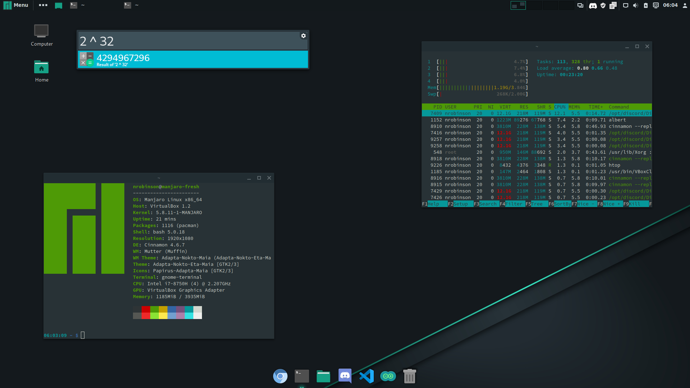

# manjaro-base



**A script and collection of files to replicate my personal [Manjaro Cinnamon](https://www.manjaro.org/downloads/community/cinnamon/) setup.**

## Installation

After installing Manjaro Cinnamon, open a terminal and enter the following:

```bash
git clone https://github.com/nrobinson2000/manjaro-base
cd manjaro-base
./setup.sh
```

For the changes to take full effect, log out of cinnamon and then log back in.

## Packages Installed

* **base-devel + yay**: Required for installing packages from [the Arch User Repository.](https://aur.archlinux.org/)
* **vim**: My preferred command-line text editor.
* **plank**: A simple dock application.
* **adapta-gtk-theme**: A pleasing theme.
* **albert + muparser**: An application launcher / calculator.
* **chromium**: The chromium web browser.